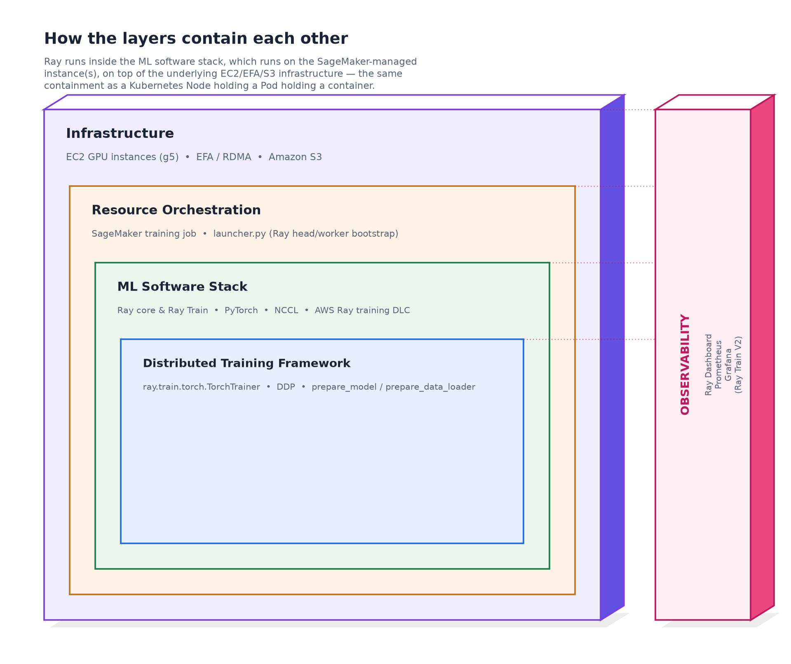
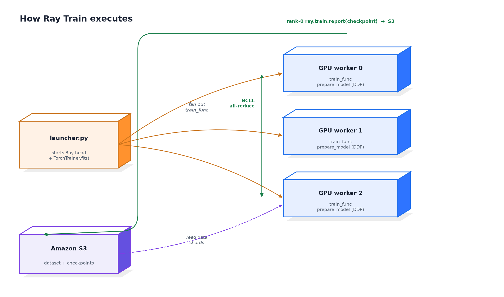

# Ray Train on Amazon SageMaker — distributed PyTorch on the official Ray Train DLC

*Illustrated: Ray Train on Amazon SageMaker training jobs — distributed ResNet image
classification on the official Ray Train DLC.*

This example runs **distributed data-parallel PyTorch training** with
[`ray.train.torch.TorchTrainer`](https://docs.ray.io/en/latest/train/train.html), as an Amazon
SageMaker training job, on AWS's official **Ray Train Deep Learning Container**
(`ray:train-ml-cuda-v1.1`) — bootstrapped by this repo's `launcher.py`. A ResNet is trained on
CIFAR-10, and the rank-0 worker checkpoints to Amazon S3.

This is a **toy workload chosen for speed, not accuracy**: CIFAR-10 (60k tiny 32×32 images,
10 classes) trains in minutes on a single GPU, which is what makes it useful here — the point
of this example isn't the image classifier, it's proving that `launcher.py` correctly stands
up a Ray cluster inside a SageMaker training job and hands a real, unmodified
`ray.train.torch.TorchTrainer` script a working GPU cluster to fan out across.

Ray is a distributed compute framework, so any Ray Train job beyond a single GPU is
multi-node by nature. This example ships the two cluster shapes you actually run on
SageMaker — a single multi-GPU instance and a heterogeneous head-plus-workers cluster — with
**one unmodified `launcher.py`** and the **same `train.py`** for both, always on the official
Ray Train DLC (there's no separate plain-container variant to keep in sync).

> 🎨 **New to this stack?** Start with the comic explainer
> [**"Who Really Runs Your Training Job?"**](comic/comic.html) — it personifies
> Kubernetes/EKS, PyTorch, Ray (Train *and* Serve), and the GPU/Trainium layer to make
> the division of labor obvious before you read the code. Open
> [`comic/comic.html`](comic/comic.html) (self-contained, images inlined); see
> [`comic/README.md`](comic/README.md) for the story arc and sources.

## How the layers stack



Bottom-up: **Infrastructure** (EC2 GPU instances, EFA/RDMA, S3) → **Resource Orchestration**
(the SageMaker training job and `launcher.py`, which bootstraps the Ray head/worker topology)
→ **ML Software Stack** (Ray core, Ray Train, PyTorch, NCCL, the Ray DLC) → **Distributed
Training Framework** (`TorchTrainer`), with **Observability** (Ray Dashboard, Prometheus,
Grafana) spanning every layer.

## How Ray Train actually works



`launcher.py` starts the Ray head and calls `TorchTrainer.fit()`, which **fans `train_func`
out** to one worker per GPU. Each worker wraps the model in DDP (`prepare_model`) and reads a
disjoint data shard (`prepare_data_loader`); gradients are **all-reduced over NCCL** each step.
The fabric differs by notebook, which is why the diagram doesn't name one: `pytorch/` puts all
GPUs on one `ml.g5.12xlarge`, so the all-reduce is over **PCIe** (A10G has no NVLink);
`pytorch-heterogeneous/` spreads them across 4x `ml.g5.xlarge` instances, so it's over the
**regular network** — neither shape needs EFA (`launcher.py` only enables it when a real EFA
device is present, and `g5.xlarge`/`g5.12xlarge` alike have none). The **rank-0** worker calls
`ray.train.report(checkpoint=...)`, which Ray Train persists to the shared `storage_path` —
here, Amazon S3 via SageMaker's `CheckpointConfig`.

## How to tell the run actually worked

There's no single "it worked" signal — check these in order; each one rules out a different
failure mode:

1. **The cluster formed.** The head's log shows `connected_nodes == cluster_size` before
   `train.py` even starts (see `_setup_head_node` in `launcher.py`) — if this times out, the
   job still runs, but on fewer workers than requested.
2. **`ray.cluster_resources()` reports the GPUs you expect.** `train.py` logs this at startup
   and auto-sizes `num_workers` to it — a wrong number here means the wrong instance type or a
   worker that never joined, not a training bug.
3. **Loss trends down and `val_accuracy` trends up, epoch over epoch** — logged every epoch as
   `epoch=... loss=... val_acc=...`. This is the only signal that's about the *model*, not the
   infrastructure; for CIFAR-10/ResNet, expect `val_accuracy` climbing well past the 10%
   random-guess baseline within the first few epochs. It doesn't need to reach a competitive
   final accuracy for this example's purpose — it only needs to be *learning*, which confirms
   gradients are actually synchronizing across workers (a DDP wiring bug usually shows up as
   loss that never moves).
4. **A checkpoint lands in S3** at `s3://.../checkpoints`, written by rank-0 only. Missing
   checkpoints with otherwise-normal logs usually means every worker reported metrics except
   rank-0 (check `ray.train.get_context().get_world_rank()` logic in `train_func`).
5. **The SageMaker job reaches `Completed`, with no `/opt/ml/output/failure` file.**
   `launcher.py` writes that file and raises before exit on any setup/execution failure (see
   "Failure & shutdown semantics" in the top-level `CLAUDE.md`), so SageMaker marks the job
   `Failed` rather than silently succeeding — a `Completed` status is the final word.

## What's here

```
ray-train/
├── pytorch/                      # homogeneous: 1x ml.g5.12xlarge
│   ├── notebook.ipynb
│   └── scripts/
│       ├── train.py             # TorchTrainer DDP + rank-0 S3 checkpointing
│       ├── model.py             # ResNet-18 with a CIFAR-10 stem
│       └── requirements.txt
├── pytorch-heterogeneous/        # heterogeneous: CPU head + 4x ml.g5.xlarge GPU workers
│   ├── notebook.ipynb
│   └── scripts/                 # identical train.py / model.py / requirements.txt
├── ray_dlc_image.py              # resolves the official Ray Train DLC's direct per-region URI
├── diagrams/
│   ├── layer-stack.png
│   ├── ray-train-flow.png
│   └── render_diagrams.py       # regenerates both
└── comic/                       # comic explainer of the whole stack (open comic/comic.html)
    ├── comic.html               # self-contained blog page (images inlined)
    ├── index.html               # editable template
    ├── render_panels.py         # regenerates the SVG panels
    ├── build_html.py            # inlines PNGs -> comic.html
    └── panels/                  # SVG sources + rendered PNGs
```

The heterogeneous notebook configures a coordinator-only head
(`head_num_cpus=0`, `head_num_gpus=0`) plus a GPU worker group; `train.py` auto-sizes
`num_workers` to the cluster's GPU count, so **the training code is identical** to the
homogeneous run — only the notebook's cluster configuration differs.

> `launcher.py` is copied into each `scripts/` directory by the first notebook cell and is
> not committed here (the repo `.gitignore` excludes `examples/**/launcher.py`).

## The container image

`ray:train-ml-cuda-v1.1` — AWS's official **Ray Train Deep Learning Container**
([`gallery.ecr.aws/deep-learning-containers/ray`](https://gallery.ecr.aws/deep-learning-containers/ray)) —
used by both notebooks, verified end to end, instead of `pip install`-ing Ray onto the plain
SageMaker PyTorch DLC.

**What's in the image:** Amazon Linux 2023, CUDA 13.0.2 (driver ≥535), Python 3.13.12;
pre-installed `ray[default,train,tune,data]==2.58.0`, `torch==2.13.0` / `torchvision==0.28.0`
(cu130), EFA 1.49.0, `boto3`, `awscli`, `pyyaml`; a generic CUDA forward-compatibility
entrypoint (`exec "$@"`) that SageMaker's own entrypoint override runs cleanly on top of. The
only thing `launcher.py` needs that isn't already there is `sagemaker-training` (already in
each `scripts/requirements.txt` — don't add `ray`/`torch`/`torchvision` pins there, the
versions baked into the image are already matched to its CUDA build). The image itself is
~10 GB, with three layers over 1.3–3.5 GB each.

**What it takes to run it:** `sagemaker:CreateTrainingJob` won't pull a training image
directly from `public.ecr.aws`, which is where this image is published
(`public.ecr.aws/deep-learning-containers/ray:train-ml-cuda-v1.1`) — but AWS also publishes
the identical image in a private, per-region ECR account under repository `ray`
(`763104351884.dkr.ecr.us-west-2.amazonaws.com/ray:train-ml-cuda-v1.1` in `us-west-2`), the
same distribution mechanism every other DLC (`pytorch-training`, `huggingface-training`, ...)
already uses, with the same broad cross-account pull permissions. No mirroring into an
account-local ECR repo is needed: confirmed by calling `ecr:BatchGetImage`/`DescribeImages` for
that repo/tag from an unrelated AWS account with no extra IAM grants, and it resolved cleanly.
`ray_dlc_image.py` resolves the right URI for your region (reusing the account map the
SageMaker SDK ships for this same repo in `ray-serve.json`); each notebook calls
`ray_dlc_image.get_ray_train_dlc_image_uri()` before launching the job.

**Verified:** a homogeneous run on `ml.g5.2xlarge` brought up Ray (`ray.init()` reporting real
GPU/CPU cluster resources), spawned a `TorchTrainer` worker, and shut down cleanly with no
`FailureReason`. The heterogeneous notebook uses the identical `launcher.py`/`train.py` path
with a different cluster shape (see "How to tell the run actually worked" above for what to
check on your own run). Two things worth knowing before you run either one:

- The image bakes `FI_PROVIDER=efa` into its `ENV` unconditionally; `launcher.py` defers to a
  pre-existing value and skips its own EFA-device autodetection — harmless without EFA
  hardware (neither `g5.xlarge` nor `g5.12xlarge` has any), worth checking if you swap in an
  EFA-capable instance type.
- Give the job enough time to actually finish training: `train.py`'s CIFAR-10 download
  (torchvision's default mirror) can be slow depending on network path. Stage the dataset via
  an S3 input channel, or raise `StoppingCondition.max_runtime_in_seconds`, for a run you
  expect to reliably complete training and checkpoint.

## Observability

Prometheus runs on the head node by default and the Ray Dashboard (port 8265, reachable over
SSM port-forwarding) shows the run. The repo's Grafana dashboard reads Ray Train **V2**
controller/worker metrics. See the top-level `README.md` for the full observability setup
(remote-write to AMP, offline embedded Prometheus/Grafana).

## References

The diagrams adapt the layered visual methodology and the four-layer building-blocks model
from:

- [Day 1 Inference — RECON article](https://day1inference.com/recon-article/) (layered /
  hover-layer visual methodology)
- [AWS Labs — Building Blocks for FM Training on AWS](https://awslabs.github.io/awsome-distributed-ai/posts/building-blocks-fm-training-aws/)
  (Infrastructure → Resource Orchestration → ML Software Stack → Distributed Framework, with
  Observability spanning all)
- [Multi-Node Ray Serve on EKS](https://github.com/lopezfelipe/sample-aws-deep-learning-containers/tree/feature-multi-node-ray-serve-sample/inference/ray-serve/ray-serve-multi-node)
  — the inference-side multi-node Ray sample (Ray Serve on EKS/KubeRay); referenced for the
  "Ray is multi-node by nature" framing. Its runtime (EKS + KubeRay + YAML) is distinct from
  this training example's SageMaker + `launcher.py` model.
